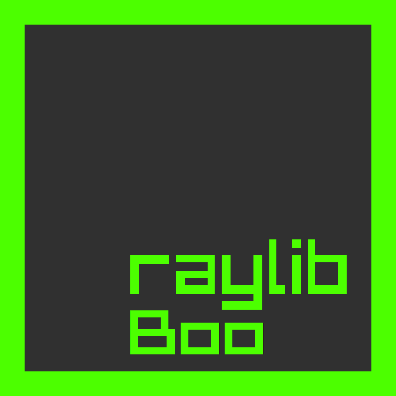

<div align="center">
	<br>
	<p>Single-file <a href="http://boo-language.github.io/">Boo </a>bindings for <a href="https://www.raylib.com">raylib</a>!</p>
</div>
<br>

### Build and usage

The bindings comes in single file contains bindings for raylib, RLGL, easings, And raymath...

#### Building instructions

> NOTE: This is in case you use raylib-boo for first time.

1. Get Boo compiler, Either [build from source](https://github.com/boo-lang/boo#build-tools) or from [releases](https://github.com/boo-lang/boo/releases) (Releases are Windows-only).
2. Clone this repo somewhere.
3. Grab copy of shared library for raylib from [raylib releases](https://github.com/raysan5/raylib/releases).

> NOTE: In 3rd step, If you use Microsoft Windows then DO NOT use MinGW-compiled libs and use MSVC ones instead!

4. Put shared library (dll, so, dylib, whatever) in directory where you cloned raylib-boo.
5. From directory where you cloned repo, Do `booc -t:library raylib_boo.boo`, This will compile bindings into shared lib depending on your OS.

#### Use bindings

1. Create boo file (It should be beside shared libs of raylib-boo and raylib to run...) with following for example:

```boo
// Save this as smallgame.boo
import raylib_boo

InitWindow(800, 450, "Smallgame")
SetTargetFPS(60)

player = Rectangle(100, 100, 50, 50)

while not WindowShouldClose():
	BeginDrawing()
	ClearBackground(RAYWHITE())
	DrawRectangleRec(player, BLUE())
	if IsKeyDown(KeyboardKey.KEY_W) or IsKeyDown(KeyboardKey.KEY_UP):
		player._y -= 5
	if IsKeyDown(KeyboardKey.KEY_S) or IsKeyDown(KeyboardKey.KEY_DOWN):
		player._y += 5
	if IsKeyDown(KeyboardKey.KEY_A) or IsKeyDown(KeyboardKey.KEY_LEFT):
		player._x -= 5
	if IsKeyDown(KeyboardKey.KEY_D) or IsKeyDown(KeyboardKey.KEY_RIGHT):
		player._x += 5
	EndDrawing()

CloseWindow()
```

2. Compile with `booc smallgame.boo` to executable and run it...

> NOTE: You can also check [`core_basic_window`](https://github.com/Rabios/raylib-boo/blob/master/core_basic_window.boo) example provided with the repo!

### Changes from raylib

As Boo have different syntax unlike other .NET languages in some concepts, There are some changes applicates to the bindings:

1. Structs members have underscore before their name (It's not optional in Boo but that's to not conflict with constructors):

```boo
pos2d as Vector2
print pos2d._x  // Instead of pos2d.x
```

2. Constants and defined colors are functions, Sorry but due to boo have problem with locals...

```boo
DrawText("Hi!", 100, 100, 20, BLUE())
```

3. Enums works like objects...

```boo
// Instead of KEY_A use KeyboardKey.KEY_A
if IsKeyDown(KeyboardKey.KEY_A):
	DrawText("ALERT!", 10, 10, 32, YELLOW())
```

4. RLGL enum are now named as `RLGLEnum` (Since it's not named...)

### Contribute

If you face any bugs or you have suggestion, Create issue [here](https://github.com/Rabios/raylib-boo/issues/new)!

### License

See [`LICENSE.txt`](https://github.com/Rabios/raylib-boo/blob/master/LICENSE.txt) for license of bindings and [`LICENSES.txt`](https://github.com/Rabios/raylib-boo/blob/master/LICENSES.txt) for third party licenses.
